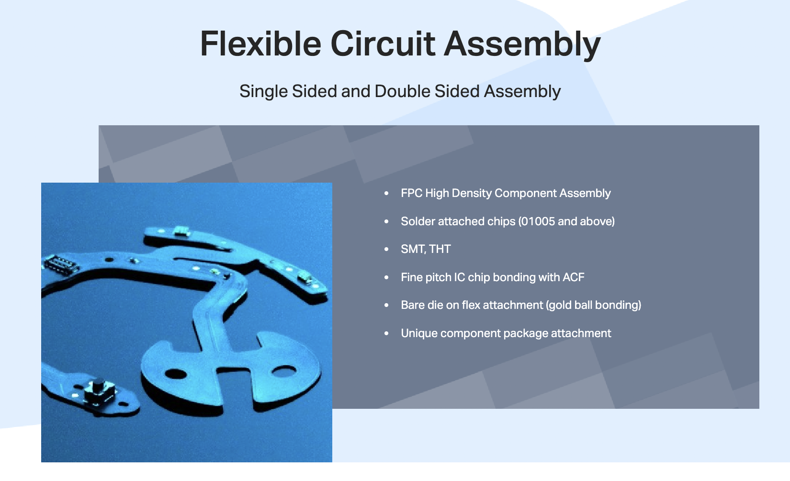
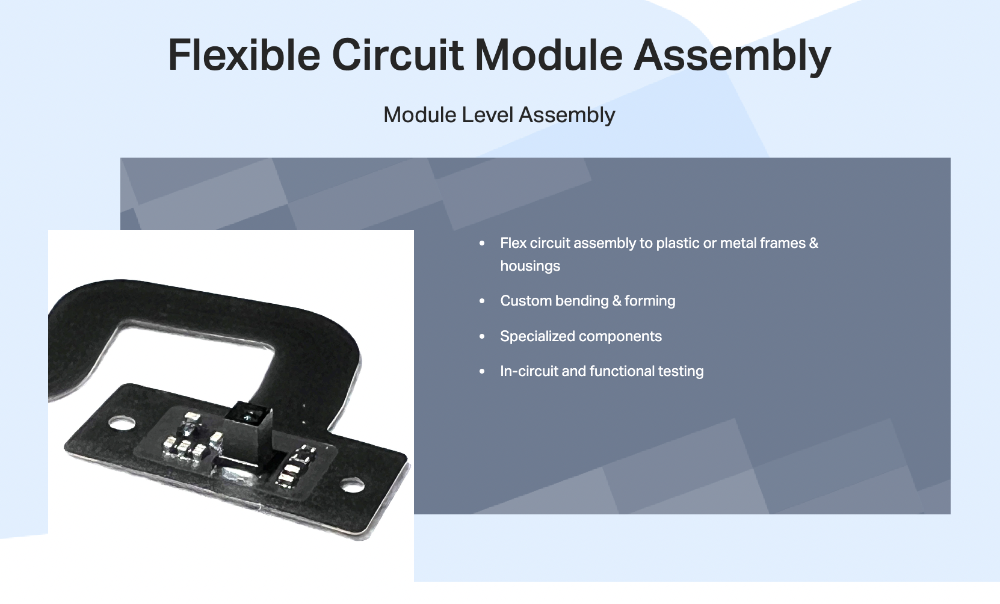
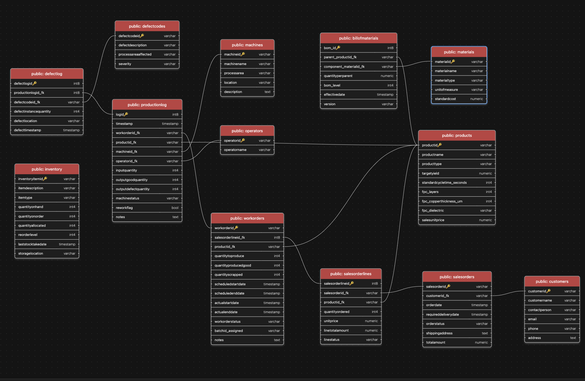
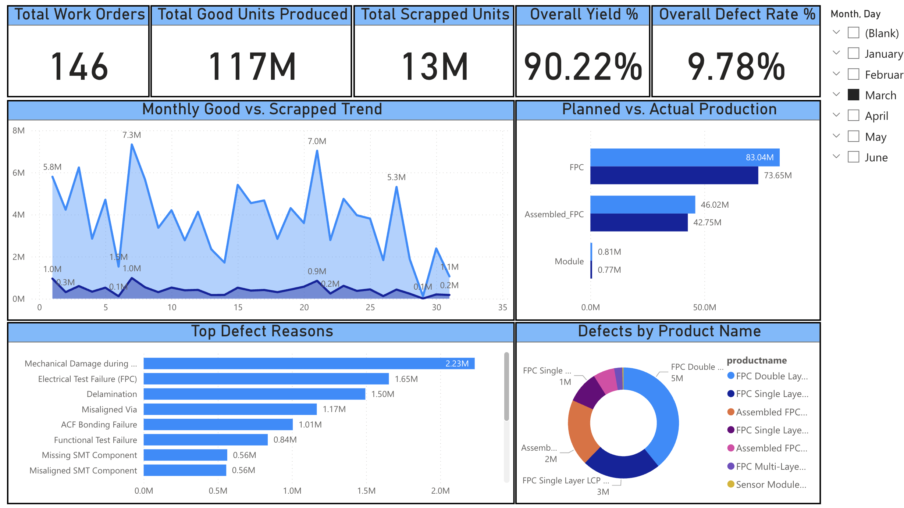
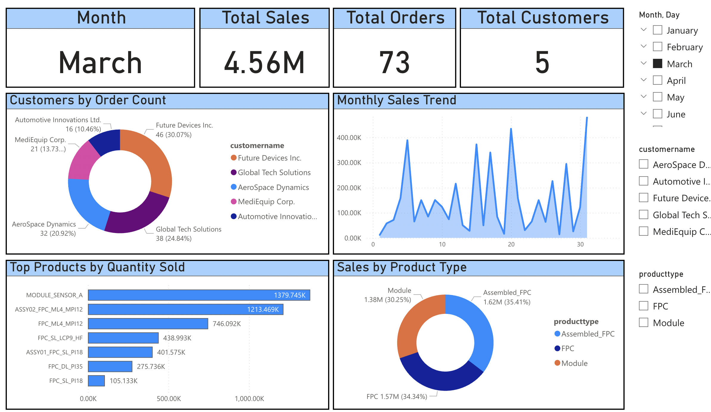

# MFLex ERP-MES Data Simulation & Analysis Project

## 📝 Project Overview

This project simulates a comprehensive Enterprise Resource Planning (ERP) and Manufacturing Execution System (MES) for "MFLex," a fictional company specializing in Flexible Printed Circuits (FPCs). The core objective is to generate realistic transactional data covering the entire manufacturing lifecycle—from sales orders through production execution and quality control. This rich dataset then powers insightful dashboards for business and operational analysis.

The project encompasses:
1.  **Master Data Initialization:** Populating the database with foundational master data for customers, products (FPCs, assembled FPCs, modules), materials, Bill of Materials (BOMs), machines, defect codes, and operators.
Data from : https://www.mflex.com/product/flexible-printed-circuits
.png)

2.  **Database Schema Design:** A PostgreSQL database schema modeling key ERP and MES entities and processes.

3.  **Transactional Data Generation:** A Python script (`generate_simulated_mflex_data.py`) that simulates the creation of sales orders, work orders, detailed production logs (including machine status, yield, and scrap), and defect logs over a defined period.
4.  **Data Analysis & Visualization:** Development of SQL analytical views and creation of interactive dashboards (Power BI) to monitor sales performance, customer behavior, product popularity, production efficiency, and quality metrics.

## 🌟 Key Features

*   **Realistic Data Model:** A database schema reflecting MFLex's manufacturing processes, including:
    *   Customer and Sales Order Management
    *   Detailed Product and Material Management (with FPC-specific attributes like layers, copper thickness)
    *   Bill of Materials (BOM) structure
    *   Work Order Management from planning to completion
    *   MES Production Logging: Capturing machine operations, input/output quantities, cycle times (conceptual), and machine status.
    *   MES Quality Logging: Recording defect codes, instances, and linking them to production activities.
    *   Master data for Machines and Operators.
*   **Dynamic Data Simulation:** The Python script generates time-series data with variability in order volumes, production yields, and potential machine downtimes, providing a dynamic dataset for analysis.
*   **End-to-End Process Simulation:** Simulates the data flow from customer orders through production planning, shop floor execution, and quality tracking.
*   **FPC Manufacturing Focus:** Product master data and simulated processes are tailored to the FPC industry (e.g., lamination, etching, SMT assembly, ACF bonding).
*   **Optimized Analytical Views:** SQL views are created to simplify data extraction and aggregate information for efficient dashboarding:
    *   `vw_Sales_Customer_Product_Details`: Consolidates sales, customer, and product information for sales performance analysis. 
    *   `vw_Production_And_Quality_Analysis`: Combines work order data with detailed production and defect logs for in-depth operational and quality analysis.

## 📊 Dashboard Highlights

This project features two main dashboards providing a comprehensive view of MFLex's operations:
- **Production & Quality Dashboard**

    
    This dashboard focuses on manufacturing efficiency and quality control, featuring:
    *   **KPIs:** Total Work Orders, Total Good Units Produced, Total Scrapped Units, Overall Yield %, Overall Defect Rate %.
    *   **Trends:** Monthly trend of good units vs. scrapped units.
    *   **Performance:** Planned vs. Actual production quantities by product type.
    *   **Quality Analysis:** Top defect reasons and a breakdown of defects by product name.

- **Sales & Customer Dashboard:**
    
    This dashboard provides insights into sales performance, customer behavior, and product demand:
    *   **Monthly Overview:** KPIs for the selected month, including Total Sales, Total Orders, and Total Customers.
    *   **Customer Analysis:** Breakdown of customers by order count.
    *   **Sales Trend:** Monthly sales trend within the selected period.
    *   **Product Insights:** Top products by quantity sold and sales distribution by product type.